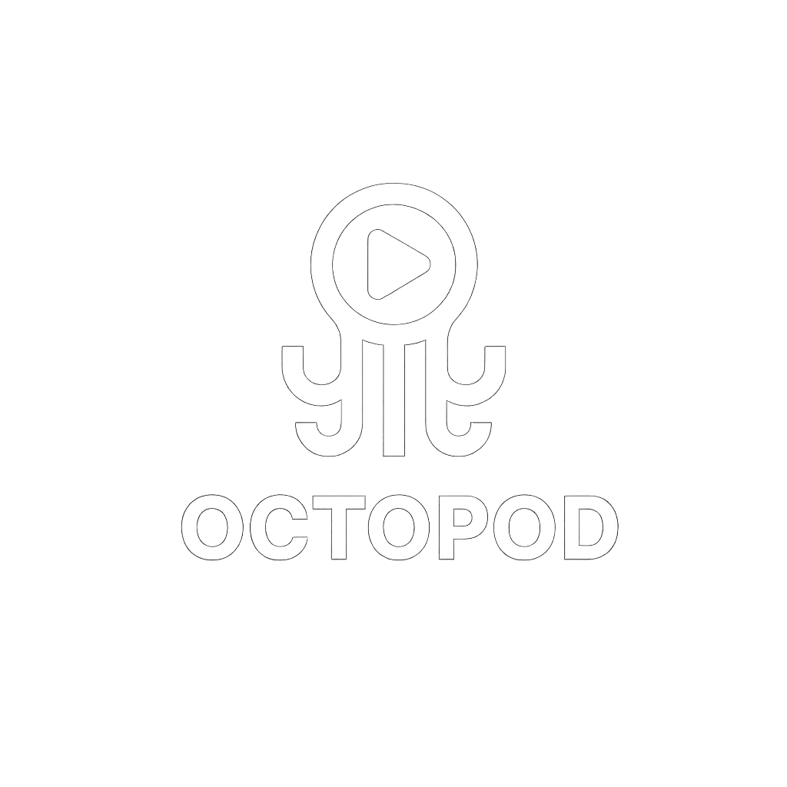

# Octopod 🎧

<p align="center">
  
</p>
<p align="center"><strong>بحث البودكاست بسرعة وذكاء مع واجهة عربية حديثة</strong></p>

## Overview

Octopod is a modern, RTL-friendly podcast search application. It offers fast search powered by the iTunes API, a responsive grid UI (optimized for mobile → tablet → desktop), smooth animations, and graceful image fallbacks. Built with Next.js (frontend) and NestJS (backend), backed by PostgreSQL, and fully containerized with Docker.

## Live Demo

[Live Demo](http://104.251.216.212:3000/search?q=فنجان)

## Core Requirements

1. Build a REST API using the framework of your choice.
2. The endpoint should accept a search term as input and query the iTunes Search API.
3. Store the returned shows from the search results in the database.
4. Return the list of stored shows in the response.
5. Build a page to display the results using Next.js & Tailwind.

## Features

- **Fast podcast search** via iTunes API
- **Responsive grid** with 2 cols (mobile), 3 (tablet), 5 (desktop)
- **Smart pagination** with 15 items per page
- **RTL Arabic support** across layout, typography, and components
- **Smooth hover animations** and transitions for an elevated UI
- **Image fallbacks** for reliable thumbnails in production
- **Modern stack**: Next.js 14 + NestJS + TypeORM + Fastify
- **PostgreSQL persistence** and caching-friendly flows
- **Dockerized** services with Docker Compose for easy dev/prod

## Getting Started

### Using Docker Compose (Recommended)

Run the entire stack locally:

```bash
docker-compose up -d
```

Services:
- Frontend → http://localhost:3000
- Backend API → http://localhost:3001 (Swagger: http://localhost:3001/api)
- PostgreSQL → port 5432

### Manual Setup

#### Backend
1) Install and run:
```bash
cd backend
npm install
npm run start:dev
```

#### Frontend
1) Install and run:
```bash
cd frontend
npm install
npm run dev
```
2) Environment (.env.local):
```env
NEXT_PUBLIC_API_URL=http://localhost:3001
```

## API Endpoints

- `GET /podcasts/search?term=<search_term>` - Search for podcasts
- `GET /podcasts/all` - Retrieve all podcasts from the database
- `DELETE /podcasts/clear` - Clear all podcasts from the database

## 🔧 Configuration

### Environment Variables

Create `.env` files in both frontend and backend directories:

#### Backend (.env)
```env
DB_HOST=localhost
DB_PORT=5432
DB_USERNAME=your_db_username
DB_PASSWORD=your_db_password
DB_DATABASE=octopod
DB_SYNC=true
```

#### Frontend (.env.local)
```env
NEXT_PUBLIC_API_URL=http://localhost:3001
```

## 🚀 Tech Stack

- **Frontend**: Next.js 14, React, TypeScript, Tailwind CSS
- **Backend**: NestJS, Fastify, TypeORM
- **Database**: PostgreSQL
- **Containerization**: Docker & Docker Compose
- **API**: iTunes Search API

## 📁 Project Structure

```
octopod/
├── backend/
│   ├── src/
│   │   ├── podcasts/
│   │   ├── app.module.ts
│   │   └── main.ts
│   ├── Dockerfile
│   └── README.md
├── frontend/
│   ├── public/
│   │   ├── logoW.png
│   │   └── favicon.ico
│   ├── src/
│   │   ├── app/
│   │   ├── components/
│   │   └── services/
│   ├── Dockerfile
│   └── README.md
├── docker-compose.yml
└── README.md
```

## 📱 UI Features

- **Grid Layout**: 3 rows × 5 columns podcast display
- **Pagination**: Smooth navigation with 15 items per page
- **Hover Animations**: Scale, shadow, and transition effects
- **Arabic Support**: Full RTL layout and typography
- **Responsive**: Mobile-first design approach

## 🎨 UI/UX Notes

- RTL-first layout and typography across pages and components
- Image error handling with graceful fallbacks and placeholders
- Reduced padding/spacing for compact mobile cards
- Subtle transitions for hover/focus states to enhance perceived performance

## 🤝 Contributing

1. Fork the repository
2. Create a feature branch (`git checkout -b feature/amazing-feature`)
3. Commit your changes (`git commit -m 'Add amazing feature'`)
4. Push to the branch (`git push origin feature/amazing-feature`)
5. Open a Pull Request

## 👤 Author

- GitHub: [3mmar19](https://github.com/3mmar19)
- Issues & support: Open an issue on GitHub
- Live Demo: Add your deployment URL when available

## 📄 License

This project is open source and available under the [MIT License](LICENSE).
